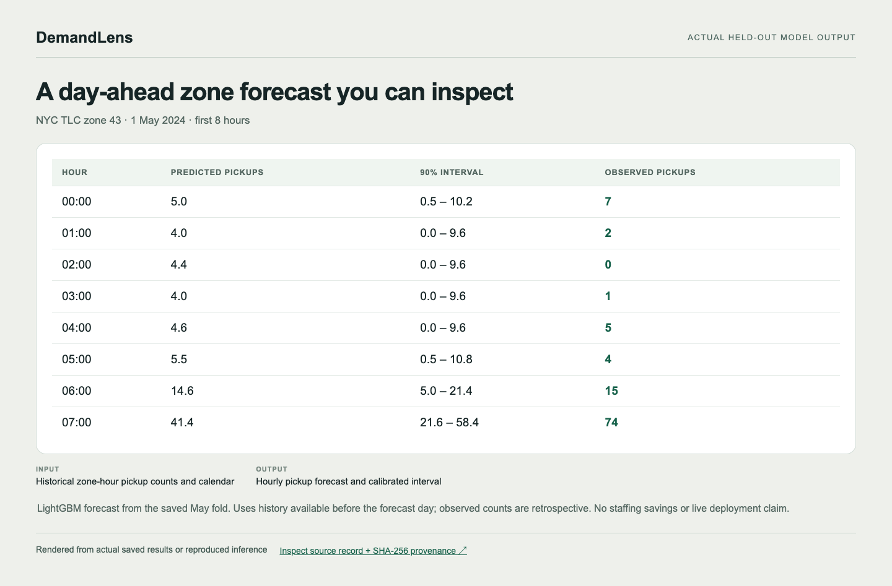
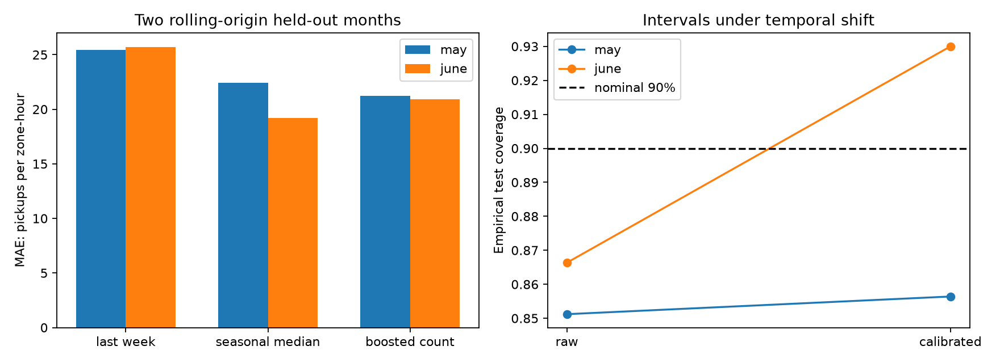
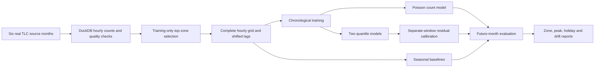

# DemandLens — Demand Forecasting With Uncertainty

[Read the project report (PDF)](docs/PROJECT_REPORT.pdf) · [Explore the explanation and flow diagram](docs/PROJECT_REPORT.md)

## Actual output example



**Input:** Historical zone-hour pickup counts and calendar. **Output:** Hourly pickup forecast and calibrated interval.

LightGBM forecast from the saved May fold. Uses history available before the forecast day; observed counts are retrospective. No staffing savings or live deployment claim.

[Inspect the full output record and source hashes](docs/output-example.json) · [Open the standalone review page](docs/output-showcase.html) · [Original dataset](https://www.nyc.gov/site/tlc/about/tlc-trip-record-data.page)

### Reproduce this example

Follow the project setup/data steps below first. `--source` points to a reproduced project directory with its local data, saved predictions or checkpoints; use `.` when running in that directory. The exporter never silently invents missing inputs.

```bash
python docs/extract_showcase.py --source /path/to/reproduced/project
python docs/render_showcase.py
# Open docs/output-showcase.html directly, or capture the image with Chrome:
npm install --no-save playwright
node docs/capture_showcase.mjs
```

The JSON records the exact source-relative filenames, SHA-256 hashes and code revision. Rendering uses saved values; displayed decimals are rounded only for readability. Raw datasets and model checkpoints remain outside this documentation bundle.


DemandLens asks an operational question: **how many pickups should we expect tomorrow, and where do forecast intervals stop being reliable?** It aggregates real NYC yellow-taxi records into hourly zone counts, trains count and quantile models, and evaluates frozen models across successive future months.

The project focuses on time-aware validation and honest uncertainty, not a claim of deployed fleet optimization. It compares trained models with simple seasonal baselines and exposes changes in interval coverage under temporal shift. The scope is yellow-taxi pickup records in 30 training-selected busy zones, not total transport demand or a staffing guarantee.



## Dataset at a glance

Six monthly **NYC TLC yellow-taxi Parquet files (January–June 2024)** contain **20,332,093 raw trip records**. A source item is a trip with a pickup time and location; cleaning retains 20,254,960 valid-month/known-zone pickups. Aggregation converts these into **131,040 rows of zone × hour pickup counts** for 30 training-selected busy zones, including hours with zero pickups.

The two chronological folds test **May and June separately**, totalling **43,920 future zone-hours**. Earlier windows supply training, development and interval calibration; exact counts are in the fold table below. These counts measure recorded yellow-taxi pickups in selected zones, not all travel demand. Raw files and derived hourly tables are not committed to Git.

## Technical snapshot

| Question | Implementation |
|---|---|
| What is trained here? | LightGBM Poisson count model and separate 5th/95th quantile models in each of two rolling-origin folds |
| Dataset | Six complete source months: NYC TLC yellow taxis, January–June 2024 |
| Zone selection | Top 30 zones by January–March pickup count only |
| Forecast horizon | Every hour of the next calendar day, issued at midnight; no current-day counts |
| Baselines | Same hour last week and median of the same hour over four prior weeks |
| Uncertainty | Raw quantiles and separate-window residual calibration; empirical coverage, width and drift |
| Not demonstrated | Guaranteed coverage under dependence, operational savings, all-city demand, production deployment |

## System flow

```text
six real TLC Parquet months -> DuckDB counts and source-quality audit
  -> January–March-only zone selection -> complete zone-hour grid
  -> strictly past-available day-ahead lag features
  -> chronological training / development / calibration / future test
  -> count and quantile models + seasonal baselines
  -> errors, coverage, widths and geographic/temporal slices
```

## Architecture



### Pre-processing

DuckDB reads each monthly Parquet with two threads and a 1 GB memory limit. Records are retained only if pickup timestamps fall in the named month and pickup zone is 1–263; unknown/outside-map zones and wrong-month timestamps are counted separately. Only pickup time and zone enter aggregation: drop-off times, distances, fares and other after-trip fields never become predictors.

The busiest 30 zones are chosen using January–March only, before both evaluated months. Missing recorded zone-hours become zero; that is an assumption about recorded pickups, not proof of no underlying demand. The six-month grid must be complete and unique before lags are computed. Source file URLs, SHA-256 hashes, raw/retained row counts and selected-zone coverage are recorded in [`outputs/provenance.json`](outputs/provenance.json).

### Learned demand and intervals

Models use calendar variables, zone, 24/48/168/336-hour lags and 24/168-hour rolling means shifted back 24 hours. All historical features precede the midnight forecast origin, including for hour 23. The seasonal-median baseline uses four prior weekly lags. There is no same-day realized-demand leakage and no within-day refresh. Twenty-eight days of initial lag history are excluded.

Separate LightGBM objectives fit the conditional count mean and 5%/95% quantiles. Crossed quantiles are sorted consistently before calibration and testing. A later, non-overlapping calibration window supplies a nonnegative residual expansion; final lower bounds are clipped at zero. This procedure is inspired by split conformalized quantile regression, but serial dependence and distribution shift mean **no unconditional 90% coverage guarantee is asserted**.

### Evaluation

Hyperparameters are frozen rather than tuned on the test months. The May fold trains through March, records early-April development diagnostics, calibrates on late April and tests May. The June fold trains through April, records early-May development diagnostics, calibrates on late May and tests June. May is future test data in the first fold and earlier calibration/development data for the later fold; this is an explicitly sequential protocol, not two independent trials.

Reports include MAE, WAPE, per-zone MASE using training-only seasonal scales, pinball losses, interval coverage and width, peak/nonpeak hours, lower-volume selected zones, listed federal holidays and first/second-half coverage drift. The holiday flag is known calendar information. Smaller zones outside the train-selected top 30 are not evaluated.

## What works today

- Six-month real-data acquisition and memory-bounded SQL aggregation.
- Source-quality counters, hashes and training-only zone selection.
- Strict day-ahead feature availability contracts and chronological windows.
- CPU-trained count/quantile models, seasonal baselines and calibrated intervals.
- Per-zone and time-regime reports, plots, local checkpoints and contract tests.

## Measured results, with context

Actual execution evidence is recorded in [`outputs/evaluation.json`](outputs/evaluation.json). All counts, metrics and limitations below refer to those artifacts; no synthetic fixtures contribute to benchmark results.

The executed pipeline processed **20,332,093 raw trip records** across six months, retaining 20,254,960 valid-month/known-zone pickups. The 30 training-selected zones cover **79.79%** of retained pickups (16,161,373) and form **131,040 zone-hour rows**. The distinct test months contain **43,920 zone-hours** in total.

| Fold | Train zone-hours | Development | Calibration | Future test |
|---|---:|---:|---:|---:|
| May | 45,360 | 10,080 | 11,520 | 22,320 |
| June | 66,960 | 10,080 | 12,240 | 21,600 |

| Future month | Last-week MAE | Four-week median MAE | Boosted-count MAE | Calibrated 90% interval coverage |
|---|---:|---:|---:|---:|
| May | 25.46 | 22.44 | 21.25 | 85.64% |
| June | 25.71 | **19.22** | 20.93 | 93.00% |

The boosted model improves on both seasonal baselines in May, but **the four-week median wins in June**. That reversal is retained, not hidden by comparison only against last-week demand. May's calibrated intervals miss the nominal 90% target; raw coverage is 85.12%. In June, calibration expands average interval width from 78.92 to 91.99 pickups and raises coverage from 86.63% to 93.00%—coverage comes with a width trade-off.

Holiday slices show more severe failure: May's holiday coverage is **43.61%** on 720 zone-hours, versus 85.64% for the month. This is an error-analysis finding, not proof of its cause. First-half/second-half, peak-hour, lower-volume-zone and per-zone diagnostics remain visible in the JSON report.

## Requirements

Python 3.12, CPU and enough disk for six monthly Parquet files (roughly 325 MB compressed) plus a virtual environment and local artifacts. DuckDB uses two threads and a 1 GB configured memory limit; models use two threads. No GPU, API key or paid inference service required. Raw data, hourly tables, row-level predictions and trained checkpoints are excluded from Git.

## Run on macOS or Linux

```bash
python3.12 -m venv .venv
source .venv/bin/activate
python -m pip install -r requirements.txt
# macOS only, if LightGBM reports a missing libomp:
export DYLD_LIBRARY_PATH="$PWD/.venv/lib/python3.12/site-packages/sklearn/.dylibs${DYLD_LIBRARY_PATH:+:$DYLD_LIBRARY_PATH}"
python demandlens.py prepare --zones 30
python demandlens.py run
python -m pytest -q
```

Preparation hashes and processes complete files; interrupted downloads retain a `.partial` file, not a finished Parquet name. Rerunning preparation downloads missing files. On the authoring host the compatible LiftLab environment was reused for this project; the same pinned dependencies can be installed in this standalone environment. Checkpoints are regenerated by `run`; do not load untrusted joblib files.

## Validate the installation

```bash
python -m pytest -q
```

Six contract tests cover origin availability, future-perturbation invariance, missing-hour and duplicate rejection, residual expansion and zero-demand metric behavior. Synthetic fixtures are used solely for these small software tests, not forecasting results. GitHub CI runs tests without external data downloads.

## Limitations and next experiments

- Six months and 30 busy zones are not all zones, all years or all transport modes.
- Taxi records measure observed pickups, not unmet demand or deployable staffing requirements.
- This is a retrospective replay assuming prior-day event counts are available at midnight; source files are published later and no real-time ingestion latency is validated.
- Provider timestamps are local wall-clock values; daylight-saving ambiguity is not resolved.
- Zero-filling, source inaccuracies and filtering affect the target and are documented assumptions.
- Temporal dependence and demand shift can break nominal interval coverage; report rather than conceal that failure.
- One training seed and fixed hyperparameters; no learning-curve or multiple-training-seed study.
- Next: full-year seasonal coverage, all-zone evaluation, rolling adaptive calibration and prospective backtests.

## Sources and licences

- [NYC TLC official trip records, metadata and quality caveats](https://www.nyc.gov/site/tlc/about/tlc-trip-record-data.page).
- [TLC trip-record user guide](https://www.nyc.gov/assets/tlc/downloads/pdf/trip_record_user_guide.pdf).
- [LightGBM objectives and parameters](https://lightgbm.readthedocs.io/en/stable/Parameters.html).
- [Conformalized Quantile Regression, Romano, Patterson and Candès](https://arxiv.org/abs/1905.03222).

Repository code is MIT licensed. TLC source data is separately governed by its provider's terms; no raw trip records are redistributed and no provider endorsement is implied. Published outputs are aggregate evaluation reports and plots, not individual trip records.
