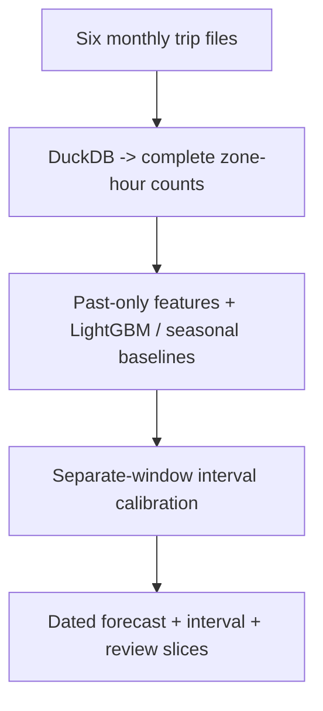

# DemandLens

Project report | Harsh Saand | 22 September 2026

## The problem

A useful demand forecast needs both a prediction and a way to see when its uncertainty stops being dependable. DemandLens forecasts recorded taxi pickups by zone and hour using information available before the forecast day.

## What a user gets

The output is a dated zone-hour forecast and interval, accompanied by error slices for peaks, holidays and location. A reviewer can inspect the forecast record and compare it with seasonal alternatives.

## Practical value

The study tests forecast usefulness on future months. The learned model wins in May but a seasonal median wins in June, and holiday coverage is weak. These results inform model choice and review thresholds; staffing savings were not measured.

## Logic and flow



<details>
<summary><strong>Dataset at a glance</strong></summary>

Six monthly **NYC TLC yellow-taxi Parquet files (January-June 2024)** contain **20,332,093 raw trip records**. A source item is a trip with a pickup time and location; cleaning retains 20,254,960 valid-month/known-zone pickups. Aggregation converts these into **131,040 rows of zone × hour pickup counts** for 30 training-selected busy zones, including hours with zero pickups.

The two chronological folds test **May and June separately**, totalling **43,920 future zone-hours**. Earlier windows supply training, development and interval calibration; exact counts are in the fold table below. These counts measure recorded yellow-taxi pickups in selected zones, not all travel demand. Raw files and derived hourly tables are not committed to Git.

</details>

<details>
<summary><strong>Technical snapshot</strong></summary>

| Question | Implementation |
|---|---|
| What is trained here? | LightGBM Poisson count model and separate 5th/95th quantile models in each of two rolling-origin folds |
| Dataset | Six complete source months: NYC TLC yellow taxis, January-June 2024 |
| Zone selection | Top 30 zones by January-March pickup count only |
| Forecast horizon | Every hour of the next calendar day, issued at midnight; no current-day counts |
| Baselines | Same hour last week and median of the same hour over four prior weeks |
| Uncertainty | Raw quantiles and separate-window residual calibration; empirical coverage, width and drift |
| Not demonstrated | Guaranteed coverage under dependence, operational savings, all-city demand, production deployment |

</details>

<details>
<summary><strong>Architecture</strong></summary>

### Pre-processing

DuckDB reads each monthly Parquet with two threads and a 1 GB memory limit. Records are retained only if pickup timestamps fall in the named month and pickup zone is 1-263; unknown/outside-map zones and wrong-month timestamps are counted separately. Only pickup time and zone enter aggregation: drop-off times, distances, fares and other after-trip fields never become predictors.

The busiest 30 zones are chosen using January-March only, before both evaluated months. Missing recorded zone-hours become zero; that is an assumption about recorded pickups, not proof of no underlying demand. The six-month grid must be complete and unique before lags are computed. Source file URLs, SHA-256 hashes, raw/retained row counts and selected-zone coverage are recorded in [`outputs/provenance.json`](https://github.com/HarshSaand/demandlens/blob/af468c63c3ef1f9ae5019640b956591796b542ab/outputs/provenance.json).

### Learned demand and intervals

Models use calendar variables, zone, 24/48/168/336-hour lags and 24/168-hour rolling means shifted back 24 hours. All historical features precede the midnight forecast origin, including for hour 23. The seasonal-median baseline uses four prior weekly lags. There is no same-day realized-demand leakage and no within-day refresh. Twenty-eight days of initial lag history are excluded.

Separate LightGBM objectives fit the conditional count mean and 5%/95% quantiles. Crossed quantiles are sorted consistently before calibration and testing. A later, non-overlapping calibration window supplies a nonnegative residual expansion; final lower bounds are clipped at zero. This procedure is inspired by split conformalized quantile regression, but serial dependence and distribution shift mean **no unconditional 90% coverage guarantee is asserted**.

### Evaluation

Hyperparameters are frozen rather than tuned on the test months. The May fold trains through March, records early-April development diagnostics, calibrates on late April and tests May. The June fold trains through April, records early-May development diagnostics, calibrates on late May and tests June. May is future test data in the first fold and earlier calibration/development data for the later fold; this is an explicitly sequential protocol, not two independent trials.

Reports include MAE, WAPE, per-zone MASE using training-only seasonal scales, pinball losses, interval coverage and width, peak/nonpeak hours, lower-volume selected zones, listed federal holidays and first/second-half coverage drift. The holiday flag is known calendar information. Smaller zones outside the train-selected top 30 are not evaluated.

</details>

<details>
<summary><strong>Measured results, with context</strong></summary>

Actual execution evidence is recorded in [`outputs/evaluation.json`](https://github.com/HarshSaand/demandlens/blob/af468c63c3ef1f9ae5019640b956591796b542ab/outputs/evaluation.json). All counts, metrics and limitations below refer to those artifacts; no synthetic fixtures contribute to benchmark results.

The executed pipeline processed **20,332,093 raw trip records** across six months, retaining 20,254,960 valid-month/known-zone pickups. The 30 training-selected zones cover **79.79%** of retained pickups (16,161,373) and form **131,040 zone-hour rows**. The distinct test months contain **43,920 zone-hours** in total.

| Fold | Train zone-hours | Development | Calibration | Future test |
|---|---:|---:|---:|---:|
| May | 45,360 | 10,080 | 11,520 | 22,320 |
| June | 66,960 | 10,080 | 12,240 | 21,600 |

| Future month | Last-week MAE | Four-week median MAE | Boosted-count MAE | Calibrated 90% interval coverage |
|---|---:|---:|---:|---:|
| May | 25.46 | 22.44 | 21.25 | 85.64% |
| June | 25.71 | **19.22** | 20.93 | 93.00% |

The boosted model improves on both seasonal baselines in May, but **the four-week median wins in June**. That reversal is retained, not hidden by comparison only against last-week demand. May's calibrated intervals miss the nominal 90% target; raw coverage is 85.12%. In June, calibration expands average interval width from 78.92 to 91.99 pickups and raises coverage from 86.63% to 93.00%; coverage comes with a width trade-off.

Holiday slices show more severe failure: May's holiday coverage is **43.61%** on 720 zone-hours, versus 85.64% for the month. This is an error-analysis finding, not proof of its cause. First-half/second-half, peak-hour, lower-volume-zone and per-zone diagnostics remain visible in the JSON report.

</details>

<details>
<summary><strong>Limitations and next experiments</strong></summary>

- Six months and 30 busy zones are not all zones, all years or all transport modes.
- Taxi records measure observed pickups, not unmet demand or deployable staffing requirements.
- This is a retrospective replay assuming prior-day event counts are available at midnight; source files are published later and no real-time ingestion latency is validated.
- Provider timestamps are local wall-clock values; daylight-saving ambiguity is not resolved.
- Zero-filling, source inaccuracies and filtering affect the target and are documented assumptions.
- Temporal dependence and demand shift can break nominal interval coverage; report rather than conceal that failure.
- One training seed and fixed hyperparameters; no learning-curve or multiple-training-seed study.
- Next: full-year seasonal coverage, all-zone evaluation, rolling adaptive calibration and prospective backtests.

</details>

<details>
<summary><strong>Using the project</strong></summary>

```bash
python3.12 -m venv .venv
source .venv/bin/activate
python -m pip install -r requirements.txt
# macOS only, if LightGBM reports a missing libomp:
export DYLD_LIBRARY_PATH="$PWD/.venv/lib/python3.12/site-packages/sklearn/.dylibs${DYLD_LIBRARY_PATH:+:$DYLD_LIBRARY_PATH}"
python demandlens.py prepare --zones 30
python demandlens.py run
python -m pytest -q
```

Preparation hashes and processes complete files; interrupted downloads retain a `.partial` file, not a finished Parquet name. Rerunning preparation downloads missing files. On the authoring host the compatible LiftLab environment was reused for this project; the same pinned dependencies can be installed in this standalone environment. Checkpoints are regenerated by `run`; do not load untrusted joblib files.

</details>

## Evidence and reproduction references

Source revision: af468c63c3ef1f9ae5019640b956591796b542ab

- [README.md](https://github.com/HarshSaand/demandlens/blob/af468c63c3ef1f9ae5019640b956591796b542ab/README.md)
- [docs/output-example.json](https://github.com/HarshSaand/demandlens/blob/af468c63c3ef1f9ae5019640b956591796b542ab/docs/output-example.json)
- [outputs/evaluation.json](https://github.com/HarshSaand/demandlens/blob/af468c63c3ef1f9ae5019640b956591796b542ab/outputs/evaluation.json)

This report describes the source and saved evidence at the revision above. Training and full benchmark runs were not repeated for this documentation release. Dataset, model and dependency licences remain separate from the project documentation.
